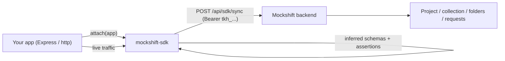

# Implement Mockshift in your application

This is the end-user guide for connecting an existing Node.js backend to
Mockshift with `mockshift-sdk`. Follow it top to bottom; by the end your app's
routes will appear in Mockshift as runnable requests, and live traffic will
teach Mockshift the request/response shapes.

- Audience: backend developers adding Mockshift to a new or existing service.
- Time: about 10 minutes for the first sync.
- Deep reference: `docs/SDK.md`. Package page: `sdk/README.md`.

## How it works



1. `attach(app)` records the routes your app defines.
2. On startup (or via the CLI) the SDK sends a manifest to Mockshift.
3. Mockshift upserts them into a collection, folder by folder.
4. While your app serves traffic, the SDK observes requests/responses and adds
   inferred schemas, suggested assertions and formula suggestions.

---

## Prerequisites

- Node.js 18 or newer.
- An Express app (v4 or v5) or a plain `http.Server`.
- A Mockshift account with permission to create projects and API tokens.
- The Mockshift base URL your app can reach, for example
  `https://mockshift.example.com` (local default: `http://localhost:3001`).

---

## Step 1 - Create a project

Sign in to Mockshift and create (or open) a project from the top bar. Routes
are synced into a **collection** inside that project; give it a short, stable
name such as `Backend`.

## Step 2 - Create an SDK token

1. Go to **Settings -> API tokens**.
2. Create a new token, give it a name, and tick the **SDK** scope.
3. Choose the project/workspace the token is bound to.
4. Copy the values shown in the one-time reveal panel.

The reveal panel gives you two things:

- A ready-to-save `mockshift.json`:

```json
{
  "token": "tkh_...",
  "baseUrl": "https://mockshift.example.com",
  "source": "express",
  "autoSync": true,
  "capture": { "enabled": true },
  "assertions": { "status": true, "json": true },
  "project": "My Project",
  "collection": "Backend"
}
```

- An install/attach snippet.

Treat the token as a secret. The reveal happens once; if you lose it, revoke
the token and create a new one.

## Step 3 - Store the config safely

Save the file next to your server entrypoint (the SDK looks for
`./mockshift.json`), but keep it out of version control:

```gitignore
# Mockshift SDK config contains a project token
mockshift.json
```

If you cannot ship a file, configure with environment variables instead
(they override the file, and code options override both):

```bash
# .env (never commit real values)
MOCKSHIFT_API_KEY=tkh_...
MOCKSHIFT_BASE_URL=https://mockshift.example.com
MOCKSHIFT_PROJECT=My Project
MOCKSHIFT_COLLECTION=Backend
```

## Step 4 - Install the SDK

```bash
npm install mockshift-sdk
```

`express` is an optional peer dependency; install it only if you use the
Express adapter.

## Step 5 - Implement it in your app

Call `attach(app)` **before** you define or mount routes, then start the
server as usual.

### Express (CommonJS)

```js
const express = require('express');
const { attach } = require('mockshift-sdk');

const app = express();

// Reads ./mockshift.json (or env). Must come before routes / app.use().
const hub = attach(app, {
  targetBaseUrl: 'http://localhost:4000',
  folder: (route) => route.path.split('/').filter(Boolean)[0] || 'Root',
});

app.get('/health', (req, res) => res.json({ ok: true }));
app.get('/api/users/:id', (req, res) => res.json({ id: req.params.id, name: 'Ada' }));

// Syncs automatically once the server is listening.
app.listen(4000, () => console.log('listening on :4000'));
```

### Express (ESM / TypeScript)

```ts
import express from 'express';
import { attach } from 'mockshift-sdk';

const app = express();
const hub = attach(app, { targetBaseUrl: 'http://localhost:4000' });

app.get('/api/users/:id', (req, res) => res.json({ id: req.params.id }));

app.listen(4000);
```

Types ship with the package (`src/index.d.ts`) — no `@types` install needed.

### Plain `http.Server`

```js
const http = require('http');
const { attachHttp } = require('mockshift-sdk');

const server = http.createServer(handler);
attachHttp(server, { apiKey: process.env.MOCKSHIFT_API_KEY, project: 'My Project' });
server.listen(4000);
```

### Middleware only (you manage `listen`)

```js
const { attach } = require('mockshift-sdk');
const hub = attach(app);
app.use(hub.middleware());   // capture traffic, no listen patching
// later, whenever you want:
await hub.sync();
```

### Mounting routers

Register sub-router routes explicitly, or `attach` the router the same way,
because `app.use('/prefix', router)` is not introspected:

```js
const router = express.Router();
attach(router);                 // patch the router's own methods
router.get('/users', listUsers); // becomes GET /users
app.use('/api', router);         // mount after
```

## Step 6 - Verify the first sync

Start your app:

```bash
npm start
```

Then open Mockshift and look inside your project -> `Backend` collection. You
should see one request per route (for example `GET /api/users/:id`).

If the app is already running and you only want to re-sync, run the CLI:

```bash
npx mockshift-sdk sync --config ./mockshift.json
```

It prints a summary such as `requests created: 3, updated: 0, folders created: 2`.

## Step 7 - Let real traffic improve the requests

With `capture.enabled: true`, send a few normal requests to your app (or run
your test suite). The SDK folds each observation into the route:

- `/api/users/42` is collapsed to `/api/users/:id`.
- The response body becomes an inferred JSON schema and sample.
- A matching `status == 200` assertion and `jsonPath` assertions are suggested.
- Field names like `id`, `createdAt` or `email` produce formula suggestions.

Explicit assertions always win over suggestions, and inference never overwrites
a `hub.test(...)` you write yourself.

## Step 8 - Pin assertions, formulas and scope

```js
const hub = attach(app, {
  include: ['/api'],          // only sync these prefixes
  exclude: ['/health', '/*'], // skip health checks and catch-all routes
  pathRules: [                // custom collapsing before :id
    { pattern: '/orders/ORD-\\d+', replacement: '/orders/:orderId' },
  ],
});

// Explicit, stable assertions (never replaced by inference)
hub.test('GET /api/users/:id', {
  status: 200,
  json: { name: 'Ada' },
  headers: { 'content-type': 'application/json' },
  responseTimeMs: 500,
});

// A per-request formula, same shape as the Mockshift formula panel
hub.register({
  method: 'POST',
  path: '/api/users',
  formula: 'req.body.id = $utils.uuid()',
});
```

## Step 9 - Production and CI

- Prefer environment variables (`MOCKSHIFT_API_KEY`, `MOCKSHIFT_BASE_URL`,
  `MOCKSHIFT_PROJECT`, `MOCKSHIFT_COLLECTION`) over a committed file.
- Set `autoSync: true` in long-running services; the sync is non-blocking and
  errors are routed to `onError` so your app never crashes because of Mockshift.
- In ephemeral CI jobs (route drift detection), run the CLI and fail the build
  on a non-zero exit:

```yaml
- run: npx mockshift-sdk sync --config ./mockshift.json
  env:
    MOCKSHIFT_API_KEY: ${{ secrets.MOCKSHIFT_API_KEY }}
```

- Keep `prune` off (default) unless you intentionally want requests missing
  from the manifest deleted. `prune: true` removes synced rows.

## Step 10 - Keep it healthy over time

- Add new routes in the usual way; they are picked up on the next restart or
  `hub.sync()`.
- If a route 401s, the token is invalid, expired or revoked: create a new SDK
  token and replace `mockshift.json`.
- If sync says the project is missing, set `project` (a workspace-bound token
  needs it) or pass `collection` explicitly.
- To stop observation temporarily, set `capture: { enabled: false }`; to stop
  inference but keep capture, set `assertions: { suggest: false }`.

## Troubleshooting

| Symptom | Likely cause | Fix |
| --- | --- | --- |
| `MockshiftConfigError: missing API key` | No token in file/env/options | Save `mockshift.json` or set `MOCKSHIFT_API_KEY` |
| Sync returns 401 | Token revoked or wrong scope | Create a new token with the **SDK** scope |
| Sync returns 404 / unknown project | `project` not set for a workspace-bound key | Set `project` (and `collection`) |
| No routes synced | `attach()` called after routes were defined | Move `attach(app)` to the top, before routes and `app.use()` |
| `Cannot find module 'express'` | Using the Express adapter without Express | `npm install express` |
| Routes mounted with a router are missing | `app.use` is not introspected | `attach(router)` before mounting, or `hub.register(...)` |
| `ALL /*` request appears | Catch-all SPA fallback | Add `exclude: ['/*']` |
| Nothing is inferred from traffic | Capture disabled or no traffic yet | Ensure `capture.enabled` and send a few requests |

## Reference

- `sdk/README.md` — package overview and API summary.
- `docs/SDK.md` — full reference: configuration, adapters, inference, sync
  protocol and server-side behaviour.
- `sdk/PUBLISHING.md` — maintainer guide for releasing the npm package.
