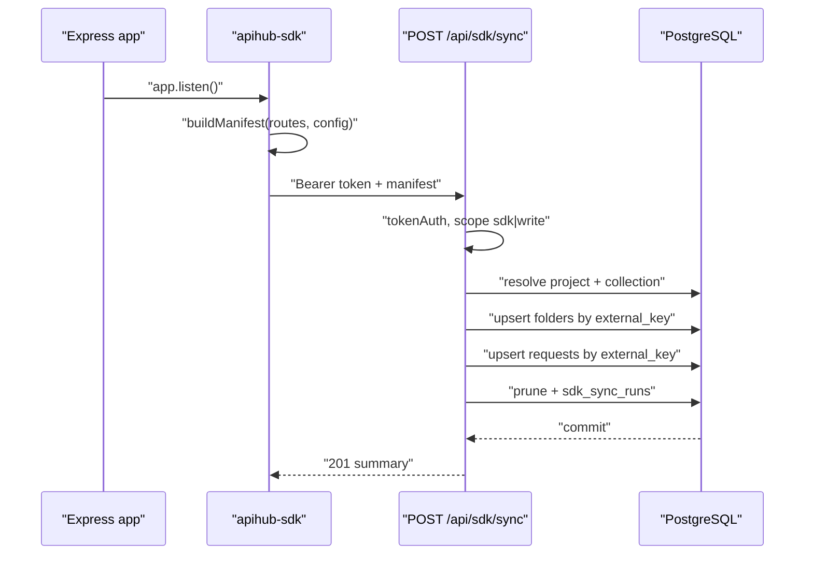

# apihub-sdk - Route Sync SDK

`apihub-sdk` syncs the routes your Express app defines into API Hub as
collections, nested folders and testable requests. Once configured, `npm start`
or a CLI command turns your running Express routes into ready-to-run entries in
the hub.

- Package: `sdk/`
- Backend endpoint: `POST /api/sdk/sync`
- Backend manifest helpers: `backend/src/api/sdkManifest.js`
- Migration: `db/migrations/037_sdk_sync.sql`

---

## 1. Installation

```bash
npm install apihub-sdk
```

Requires Node.js 18+ (the client uses the global `fetch` and
`AbortSignal.timeout`).

---

## 2. Quick start

```js
const express = require('express');
const { attach } = require('apihub-sdk');

const app = express();
const hub = attach(app, {
  apiKey: process.env.APIHUB_API_KEY,
  baseUrl: 'http://localhost:3001',
  collection: 'Backend',
  targetBaseUrl: 'http://localhost:4000',
  folder: (route) => route.path.split('/').filter(Boolean)[0] || 'Root',
});

app.get('/health', (req, res) => res.json({ ok: true }));
app.get('/users/:id', (req, res) => res.json({ id: req.params.id }));

hub.test('GET /users/:id', { status: 200, json: { id: '1' } });
// Syncs automatically when the server starts. You can also call `await hub.sync()`.
app.listen(4000);
```

---

## 3. Configuration

Options can be passed to `attach(...)`/`createHub(...)` or supplied through
environment variables.

| Option | Env var | Default | Meaning |
| --- | --- | --- | --- |
| `apiKey` | `APIHUB_API_KEY` | - | Project- or workspace-bound key (required). |
| `baseUrl` | `APIHUB_BASE_URL` | `http://localhost:3001` | API Hub backend base URL. |
| `project` | `APIHUB_PROJECT` | - | Project name (required for a workspace-bound key). |
| `workspace` | `APIHUB_WORKSPACE` | - | Workspace name (informational). |
| `collection` | `APIHUB_COLLECTION` | project name | Collection to sync into. |
| `targetBaseUrl` | `APIHUB_TARGET_BASE_URL` | `''` | Base URL prepended to each route path. |
| `folder` | - | first path segment | String or `(route) => 'A/B'` nested folder path. |
| `structure` | - | - | `{ '/users': 'Users', '/users/:id/posts': 'Users/Posts' }` longest-prefix map. |
| `include` / `exclude` | - | `[]` | Path prefixes to include/exclude. |
| `autoSync` | - | `true` | Sync once the server starts listening. |
| `prune` | - | `false` | Delete synced requests missing from the manifest. |
| `timeoutMs` | - | `5000` | HTTP timeout for a sync call. |
| `onError` | - | `null` | Callback for non-blocking sync errors. |
| `source` | - | `express` | Source tag stored on synced rows. |

The API key may also come from `APIHUB_PROJECT_KEY` or
`APIHUB_WORKSPACE_KEY`. The key is required and is sent as
`Authorization: Bearer <key>`; missing keys throw `ApiHubConfigError`.

See `sdk/src/config.js` for the exact resolution order.

---

## 4. Programmatic API

Import surface (`sdk/src/index.js`, types in `sdk/src/index.d.ts`):

| Member | Purpose |
| --- | --- |
| `createHub(options)` | Create a hub without touching an Express app. |
| `attach(app, options)` | Create a hub **and** install the Express adapter. |
| `hub.register(route)` | Manually register `{ method, path, ... }`; deduped by method+path. |
| `hub.test(key, expects)` | Attach friendly assertions to a registered route. |
| `hub.manifest()` | Build the manifest that would be sent. |
| `await hub.sync()` | Send the manifest; resolves to the server result. |
| `hub.syncSoon()` | Non-blocking `sync()`; routes errors to `onError`. |
| `hub.express(app, options)` | Install the adapter on an app manually. |

`register` merges repeated registrations for the same method+path rather than
duplicating them.

---

## 5. Express adapter

Installing the adapter patches `app.get/post/put/patch/delete/options/head/all`
and `app.listen`:

- Every string path that starts with `/`, has at least one handler function and
  passes the include/exclude filter is registered.
- Path arrays are expanded element by element.
- `app.all(...)` routes are recorded with method `ALL`.
- After `app.listen(...)` returns, the adapter triggers `syncSoon()` when
  `autoSync` is enabled.

### Gotcha: `app.all` and `app.use`

The adapter must be installed **before** your routes and before you mount
sub-routers with `app.use`, otherwise those routes are never captured. If you
use a catch-all `app.all('*', ...)` (for example a SPA fallback), it will be
synced as a route named `ALL /*`. Exclude it:

```js
attach(app, {
  apiKey: process.env.APIHUB_API_KEY,
  exclude: ['/*'],
});
```

---

## 6. Folder resolution

`resolveFolderPath` (`sdk/src/folders.js`) chooses the folder in this order:

1. `config.folder` as a function - return a slash-separated path, for example
   `'Users/Admin'`.
2. `config.folder` as a non-empty string - a fixed folder for all routes.
3. `config.structure` - longest matching path prefix wins.
4. Default - the first path segment, title-cased, or `Root` for `/`.

Folder paths are cleaned: split on `/`, trimmed, empty segments dropped, each
segment title-cased. Parent folders are emitted before children, so nested
folders are recreated in order.

---

## 7. Assertions (`hub.test`)

`hub.test(key, expects)` maps a friendly object onto the API Hub assertion
shape via `normalizeExpects` (`sdk/src/assertions.js`):

| `expects` field | Generated assertion |
| --- | --- |
| `status: 200` | `status eq 200` |
| `json: { 'id': '1' }` | `jsonPath eq` for each key |
| `headers: { 'content-type': 'application/json' }` | `header contains` for each key |
| `responseTimeMs: 500` | `responseTime lt 500` |

Generated assertion ids are `sdk-a1`, `sdk-a2`, ... Status and expected values
are stringified. The `key` must match a registered route's `key` (defaults to
`METHOD /path`) or an `ApiHubConfigError` is thrown.

---

## 8. CLI

```bash
npx apihub-sdk sync --config ./apihub.config.cjs
```

The config module must export a configured hub (created with `createHub`) that
has a `sync()` method. The CLI prints a one-line summary of created/updated
requests and created folders, and returns:

- `0` success
- `1` load/sync failure
- `2` usage error (missing command or `--config`)

Example `apihub.config.cjs`:

```js
const { createHub } = require('apihub-sdk');

module.exports = createHub({
  apiKey: process.env.APIHUB_API_KEY,
  collection: 'Backend',
  targetBaseUrl: 'https://api.example.com',
  routes: [],
});

module.exports.register({ method: 'GET', path: '/users' });
module.exports.register({ method: 'GET', path: '/users/:id' });
```

---

## 9. Sync protocol

The SDK POSTs a JSON manifest to `/api/sdk/sync` with the Bearer token.

```json
{
  "source": "express",
  "project": "My API",
  "workspace": "Platform",
  "collection": "Backend",
  "projectId": null,
  "workspaceId": null,
  "targetBaseUrl": "https://api.example.com",
  "prune": false,
  "folders": [
    { "key": "Users", "name": "Users", "parent": null },
    { "key": "Users/Admin", "name": "Admin", "parent": "Users" }
  ],
  "requests": [
    {
      "key": "GET /users/:id",
      "name": "GET /users/:id",
      "method": "GET",
      "path": "/users/:id",
      "url": "https://api.example.com/users/:id",
      "apiType": "REST",
      "folder": "Users",
      "headers": [],
      "queryParams": [],
      "bodyType": "NONE",
      "bodyJson": null,
      "bodyText": null,
      "assertions": [],
      "sourceFile": null
    }
  ]
}
```

Validation (`backend/src/api/sdkManifest.js`):

- `folders` and `requests` must be arrays when present.
- Each request needs `method` (one of `GET, POST, PUT, PATCH, DELETE, HEAD,
  OPTIONS, QUERY`) and `path`.
- Folder `key` is required; unknown parents and cycles are rejected.
- Missing `key` defaults to `METHOD /path`; missing `name` defaults to the key.
- Missing `url` is joined from `targetBaseUrl` + `path`.

The response is `201`:

```json
{
  "summary": {
    "collectionId": "uuid",
    "collections": { "created": 0 },
    "folders": { "created": 2, "updated": 0 },
    "requests": { "created": 5, "updated": 0, "pruned": 0 }
  },
  "projectId": "uuid",
  "collectionId": "uuid",
  "requestIds": ["uuid"]
}
```

### Server-side behavior (`backend/src/api/routes/sdk.js`)

- **Token auth** with scope `sdk` or `write` required.
- **Target resolution:**
  - *Project-bound token* - uses that project; requires `EDITOR`+.
  - *Workspace-bound token* - finds or creates a project named by
    `manifest.project` (default `SDK Sync`); requires workspace write access.
  - *Unbound token* - requires an explicit `projectId` with `EDITOR`+.
- **Upsert by `external_key`** - folders and requests are matched on
  `external_key`; repeats update in place. Names are made unique with
  `pickUniqueName` (`(copy)`, `(copy) 2`, ...).
- **Prune** - when `prune: true` and the manifest has requests, synced requests
  whose `external_key` is absent are deleted. Prune is scoped by `source` and
  only touches rows with a non-null `external_key`.
- **Plan gates** - `projects`, `collections` and `api_requests` count gates are
  enforced; over-limit calls return `403 plan_limit`.
- **Audit** - every sync writes a row to `sdk_sync_runs` (token, user,
  workspace, project, collection, source, summary) inside one transaction.

---

## 10. Sync flow



---

## 11. Troubleshooting

| Symptom | Cause / fix |
| --- | --- |
| `API key is required` | Set `apiKey` or `APIHUB_API_KEY`. |
| `403 API token requires the "sdk" or "write" scope` | Recreate the token with the `sdk` or `write` scope. |
| Routes missing from the sync | Adapter installed after routes, or paths excluded; install `attach` first and check `include`/`exclude`. |
| Catch-all route synced | Exclude `/*`; see section 5. |
| `Provide projectId, or use a project/workspace-bound key` | An unbound token needs `manifest.projectId`. |
| Old requests remain | Set `prune: true` (only prunes rows previously synced by the SDK). |
| `403 plan_limit` | The organization's plan limit for projects/collections/requests was hit. |
| Sync hangs | Raise `timeoutMs`; default is 5000 ms. |

---

## 12. Testing

- SDK unit tests: `cd sdk && npm test` (covers config, client, manifest,
  folders, assertions, CLI, express adapter, index).
- Backend manifest unit test: `backend/src/api/__tests__/sdkManifest.test.cjs`
  (or `sdkManifest.test.cjs`).
- Backend integration test: `sdkSync.integration.test.cjs` (uses the scratch
  Postgres cluster on port 5441).

> **Gap:** the checkboxes in
> `docs/superpowers/plans/2026-09-10-apihub-sdk-route-sync.md` are still
> unticked even though the implementation and tests exist. The plan document
> should be updated or archived.
